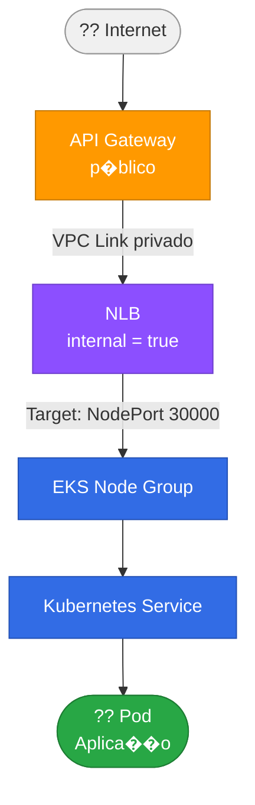

# fiap-14soat-tc-fase5-iac-terraform


[](https://github.com/jonasfschuh/fiap-14soat-tc-fase5-iac-terraform/actions/workflows/deploy.yaml)

---

## ?? Sum�rio

- [?? Autor](#-autor)
- [?? Descri��o](#-descri��o)
- [??? Arquitetura](#?-arquitetura)
- [??? Tecnologias Utilizadas](#?-tecnologias-utilizadas)
- [?? Vari�veis de Configura��o](#?-vari�veis-de-configura��o)
- [?? Prote��o da Branch main](#-prote��o-da-branch-main)
- [?? Execu��o e Deploy](#-execu��o-e-deploy)
- [?? Documenta��o T�cnica](#-documenta��o-t�cnica)
- [?? V�deos de Apresenta��o](#-v�deos-de-apresenta��o)
- [?? Estrat�gia de TFState Compartilhado](#-estrat�gia-de-tfstate-compartilhado)
- - [?? Reposit�rios Relacionados](#-reposit�rios-relacionados)

---

## ?? Autor

| Nome                 | E-mail                  | RM        | Discord          | WhatsApp        |
|----------------------|-------------------------|-----------|------------------|-----------------|
| Jonas Fernando Schuh | jonasschuh@hotmail.com  | rm369458  | jonasf.schuh     | 47 9 9960-1396  |

**Grupo:** 3 � RaceForce � FIAP 14SOAT Fase 5

---

## ?? Descri��o

Este reposit�rio provisiona toda a **infraestrutura base da AWS** necess�ria para execu��o do projeto de Tech Challenge da Fase 5 (FIAP 14SOAT), utilizando **Terraform** como ferramenta de IaC.

Os principais recursos provisionados s�o:

- **Amazon EKS** � cluster Kubernetes gerenciado com node group auto-escal�vel;
- **Amazon VPC** � rede isolada com subnets p�blicas em m�ltiplas AZs, Internet Gateway e tabelas de rota;
- **NLB Interno** � Network Load Balancer privado (`internal = true`) integrado ao API Gateway via VPC Link;
- **AWS IAM** � roles e access entries necess�rios para o cluster e o CI/CD;
- **Amazon S3** � bucket para armazenamento do Terraform state remoto, compartilhado entre os reposit�rios da stack;
- **New Relic** (opcional) � instala��o do chart `nri-bundle` no cluster via `helm_release`.

> ?? Este reposit�rio **n�o** inclui a aplica��o, o banco de dados nem a Lambda de autentica��o � cada um possui seu pr�prio reposit�rio (ver se��o [Reposit�rios Relacionados](#-reposit�rios-relacionados)).

---

## ??? Arquitetura

### Diagrama de Componentes


### Fluxo de Acesso Externo

```
Internet
    �
    ?
API Gateway (p�blico)
    �  VPC Link (privado)
    ?
NLB (internal = true)
    �  Target: NodePort 30000
    ?
EKS Node Group
    �
    ?
Kubernetes Service ? Pod (Aplica��o)
```

Fluxo detalhado em mermaid. OBS: Necess�rio plugin Mermaid para renderiza��o.



O **NLB interno** garante que o EKS **n�o seja exposto diretamente na internet** � toda requisi��o externa obrigatoriamente passa pelo API Gateway (com Lambda Authorizer para autentica��o por CPF).

### Topologia de Rede (VPC)

```
VPC (10.0.0.0/16)
+-- Subnet us-east-1a (p�blica)
+-- Subnet us-east-1b (p�blica)
+-- Subnet us-east-1c (p�blica)
+-- Internet Gateway
+-- Route Table ? 0.0.0.0/0 ? IGW
```

### Outputs publicados no State Remoto

| Output                | Descri��o                                        |
|-----------------------|--------------------------------------------------|
| `vpc_principal_id`    | ID da VPC principal                              |
| `vpc_principal_cidr`  | Bloco CIDR da VPC                                |
| `subnet_publica_ids`  | IDs das subnets p�blicas usadas pelo EKS         |
| `eks_cluster_name`    | Nome do cluster EKS                              |
| `nlb_dns_name`        | DNS do Network Load Balancer                     |
| `nlb_arn`             | ARN do NLB                                       |
| `nlb_listener_arn`    | ARN do listener do NLB (consumido pela Lambda stack) |

---

## ??? Tecnologias Utilizadas

| Tecnologia         | Vers�o / Uso                                                                  |
|--------------------|-------------------------------------------------------------------------------|
| **Terraform**      | IaC � provisionamento de todos os recursos AWS                                |
| **AWS EKS**        | Cluster Kubernetes gerenciado (`eks-cluster-fiap-14soat-fase5-raceforce`)    |
| **AWS VPC**        | Rede isolada com subnets p�blicas e Internet Gateway                          |
| **AWS NLB**        | Network Load Balancer interno para integra��o com API Gateway via VPC Link    |
| **AWS IAM**        | Roles (`LabRole`) e access entries para EKS e nodes                           |
| **AWS S3**         | Backend remoto do Terraform state compartilhado entre as stacks               |
| **Helm**           | Instala��o do `nri-bundle` New Relic no cluster                               |
| **New Relic**      | Observabilidade: m�tricas Kubernetes, APM, logs e alertas (opcional via flag) |
| **GitHub Actions** | Pipeline CI/CD de deploy e destroy automatizados                              |

---

## ?? Vari�veis de Configura��o

Crie o arquivo `infra/terraform.tfvars` com base no exemplo abaixo:

```hcl
# infra/terraform.tfvars

bucket_name            = "fiap-14soat-fase5-jonasfschuh"
eks_cluster_name       = "eks-cluster-fiap-14soat-fase5-raceforce"
eks_cluster_role_name  = "LabRole"
eks_node_role_name     = "LabRole"
aws_region             = "us-east-1"

eks_node_instance_types       = ["t3.medium"]
eks_node_scaling_desired_size = 2
eks_node_scaling_max_size     = 2
eks_node_scaling_min_size     = 1

enable_new_relic               = true
new_relic_namespace            = "newrelic"
new_relic_helm_timeout_seconds = 900
# new_relic_license_key = "via TF_VAR_new_relic_license_key (n�o comitar)"
```

### Secrets e Vari�veis para CI/CD (GitHub Actions)

| Secret / Variable                    | Descri��o                                                          |
|--------------------------------------|--------------------------------------------------------------------|
| `AWS_ACCESS_KEY_ID`                  | Credencial AWS Academy                                             |
| `AWS_SECRET_ACCESS_KEY`              | Credencial AWS Academy                                             |
| `AWS_SESSION_TOKEN`                  | Token de sess�o AWS Academy                                        |
| `NEW_RELIC_KEY`                      | Chave de licen�a New Relic (`TF_VAR_new_relic_license_key`)       |
| `NEW_RELIC_ACCOUNT_ID`               | Account ID New Relic (quando aplic�vel)                            |
| `TF_VAR_ENABLE_NEW_RELIC`            | `true` / `false`                                                   |
| `TF_VAR_EKS_NODE_INSTANCE_TYPES`     | Ex: `["t3.medium"]`                                                |
| `TF_VAR_EKS_NODE_SCALING_DESIRED_SIZE` | Ex: `2`                                                          |
| `NEW_RELIC_HELM_TIMEOUT_SECONDS`     | Ex: `900`                                                          |

> ?? Use o script `syncaws.ps1` para sincronizar as credenciais do AWS Academy com os secrets do GitHub Actions ap�s cada renova��o de sess�o.

---

## ?? Prote��o da Branch main

As regras abaixo foram aplicadas em todos os 4 reposit�rios da stack para atender ao requisito do Tech Challenge:

> *"Branch main protegida (sem commits diretos). Uso obrigat�rio de Pull Requests para merge. Deploy autom�tico das branches de produ��o."*

### Regras configuradas no GitHub ? Settings ? Branches

| Regra | Valor                                                                                                      |
|---|------------------------------------------------------------------------------------------------------------|
| **Require a pull request before merging** | ? Ativado � bloqueia commits diretos na `main`                                                             |
| **Required approvals** | `1` revis�o obrigat�ria antes do merge (OBS: no caso desse estudo desabilitado que tem 1 pessoa no grupo)  |
| **Dismiss stale reviews on new commits** | ? Ativado � revalida aprova��o se o PR for atualizado                                                      |
| **Require status checks to pass** | ? Ativado � bloqueia merge se o PR Validation falhar                                                       |
| **Require branches to be up to date** | ? Ativado � evita merge de branch desatualizada                                                            |
| **Do not allow bypassing** | ? Ativado � nem o owner ignora as regras                                                                   |

### Status check obrigat�rio neste reposit�rio

| Check | Job no `pr-validation.yaml` |
|---|---|
| `terraform-validation` | Valida `terraform fmt`, `init` e `validate` na pasta `infra/` |

> ?? O status check s� aparece para sele��o no GitHub ap�s a **primeira execu��o bem-sucedida** do PR Validation.

---

## ??? Deploy Manual � Decis�o de Projeto (AWS Academy)

> *"Por que o deploy n�o � acionado automaticamente a cada `push` para `main`?"*

Os workflows de deploy desta stack utilizam `workflow_dispatch` (disparo manual) de forma **intencional e justificada**. Essa decis�o foi tomada em raz�o da **natureza ef�mera do ambiente AWS Academy**:

- Cada sess�o do AWS Academy possui um limite de **4 horas** de execu��o ativa;
- As credenciais (`AWS_ACCESS_KEY_ID`, `AWS_SECRET_ACCESS_KEY`, `AWS_SESSION_TOKEN`) expiram ao fim de cada sess�o e precisam ser renovadas manualmente;
- Um trigger autom�tico a cada `push` para `main` **recriaria toda a infraestrutura a cada commit**, consumindo rapidamente o budget de horas dispon�vel e gerando custos desnecess�rios com recursos provisionados fora do per�odo de uso;
- A recria��o autom�tica de recursos como **clusters EKS, VPC, subnets e NLB** dentro do ciclo de 4 horas tornaria invi�vel o uso cont�nuo da plataforma para demonstra��o e valida��o acad�mica.

**O deploy � iniciado manualmente pelo autor** via *GitHub Actions ? Run workflow*, garantindo controle total sobre quando os recursos s�o provisionados e consumindo o budget de forma consciente e respons�vel.

> ?? **Outputs de produ��o:** Os outputs do Terraform (nome do cluster EKS, DNS do NLB, etc.) s�o gravados no state remoto S3 e consumidos automaticamente pelos demais reposit�rios da stack. Os valores s�o exibidos no **GitHub Actions Summary** ap�s cada execu��o bem-sucedida do workflow de deploy.

---

## ?? Execu��o e Deploy

### Pr�-requisitos

- [Terraform](https://developer.hashicorp.com/terraform/downloads) >= 1.3
- [AWS CLI](https://aws.amazon.com/cli/) configurado (`aws configure`)
- [kubectl](https://kubernetes.io/docs/tasks/tools/)
- [Helm](https://helm.sh/docs/intro/install/) >= 3
- Bucket S3 `fiap-14soat-fase5-jonasfschuh` criado na regi�o `us-east-1` (bootstrap idempotente feito pelos workflows de CI/CD)

### 1. Inicializar o Terraform

```bash
cd infra
terraform init -reconfigure
```

### 2. Validar a configura��o

```bash
terraform validate
```

### 3. Visualizar o plano de execu��o

```bash
terraform plan -var-file="terraform.tfvars"
```

### 4. Aplicar a infraestrutura

```bash
terraform apply -var-file="terraform.tfvars"
```

> ?? O VPC Link pode levar **5�10 minutos** para ficar dispon�vel ap�s o `apply`.

### 5. Configurar o `kubectl`

```bash
aws eks update-kubeconfig \
  --name eks-cluster-fiap-14soat-fase5-raceforce \
  --region us-east-1

kubectl get nodes
```

### 6. Destruir a infraestrutura (economia de budget no AWS Academy)

```bash
terraform destroy -var-file="terraform.tfvars"
```

---

## ?? Documenta��o T�cnica

| Tipo   | Arquivo | Descri��o |
|--------|---------|-----------|
| ?? RFC  | [RFC-003 � Provisionamento EKS, VPC e NLB](docs/RFC%20-%20Requests%20for%20Comments/RFC-003-infraestrutura-kubernetes.md) | Justificativa t�cnica das escolhas de infraestrutura |
| ?? RFC  | [RFC-004 � Banco de Dados Compartilhado AWS Academy](docs/RFC%20-%20Requests%20for%20Comments/RFC-004-banco-dados-rds-compartilhado-aws-academy.md) | Justificativa da consolida��o dos bancos PostgreSQL em inst�ncia RDS �nica |
| ??? ADR | [ADR-003 � NLB Interno + VPC Link](docs/ADR%20-%20Architecture%20Decision%20Records/ADR-003-nlb-interno-vpc-link.md) | Decis�o arquitetural: NLB interno como padr�o de comunica��o Gateway ? EKS |
| ??? ADR | [ADR-004 � Inst�ncia RDS Compartilhada](docs/ADR%20-%20Architecture%20Decision%20Records/ADR-004-banco-dados-rds-compartilhado.md) | Decis�o arquitetural: inst�ncia RDS PostgreSQL �nica compartilhada entre 6 MSs (AWS Academy) |
| ??? Diagrama | [Components - repo-iac-terraform.drawio.png](docs/diagrams/Components-repo-iac-terraform.drawio.png) | Diagrama de componentes provisionados |

> ?? **Swagger / OpenAPI:** n�o aplic�vel � este reposit�rio � exclusivamente de infraestrutura (IaC). A documenta��o da API REST est� no reposit�rio [fiap-14soat-tc-fase5-app-k8s](https://github.com/jonasfschuh/fiap-14soat-tc-fase5-app-k8s).


---

### ?? V�deos de Apresenta��o

| Fase | Link |
|------|------|
| Fase 1  | [Apresenta��o Tech Challenge 1 � RaceForce](https://youtu.be/EKwE8l4yE1M) |
| Fase 2  | [Apresenta��o Tech Challenge 2 � RaceForce](https://youtu.be/95ml0-H9Vf4) |
| Fase 3  | [Apresenta��o Tech Challenge 3 � RaceForce](https://www.youtube.com/watch?v=KB-FC_4zsPE) |
| Fase 5  | [Apresenta��o Tech Challenge 4 � RaceForce](https://www.youtube.com/watch?v=vR3x4kW0l90) |
---

## ?? Estrat�gia de TFState Compartilhado

Este reposit�rio usa um bucket S3 �nico compartilhado entre todas as stacks da solu��o:

| Stack       | Bucket                           | Key                              |
|-------------|----------------------------------|----------------------------------|
| Infra (este) | `fiap-14soat-fase5-jonasfschuh`  | `infra/terraform.tfstate`        |
| Lambda Auth | `fiap-14soat-fase5-jonasfschuh` | `lambda-auth/terraform.tfstate`  |

> ?? O bucket S3 **deve existir antes** do `terraform init` com backend S3. Os workflows de CI/CD realizam o bootstrap de forma idempotente via AWS CLI.

---

## ?? Reposit�rios Relacionados


| Ordem | Reposit�rio                                                                                               | Descri��o                                |
|-------|-----------------------------------------------------------------------------------------------------------|------------------------------------------|
| 1     | [fiap-14soat-tc-fase5-iac-terraform](https://github.com/jonasfschuh/fiap-14soat-tc-fase5-iac-terraform)   | VPC, EKS, NLB, SQS � infraestrutura base |
| 2     | [fiap-14soat-tc-fase5-auth-lambda](https://github.com/jonasfschuh/fiap-14soat-tc-fase5-auth-lambda)       | Lambda Login + Authorizer + API Gateway  |

---
